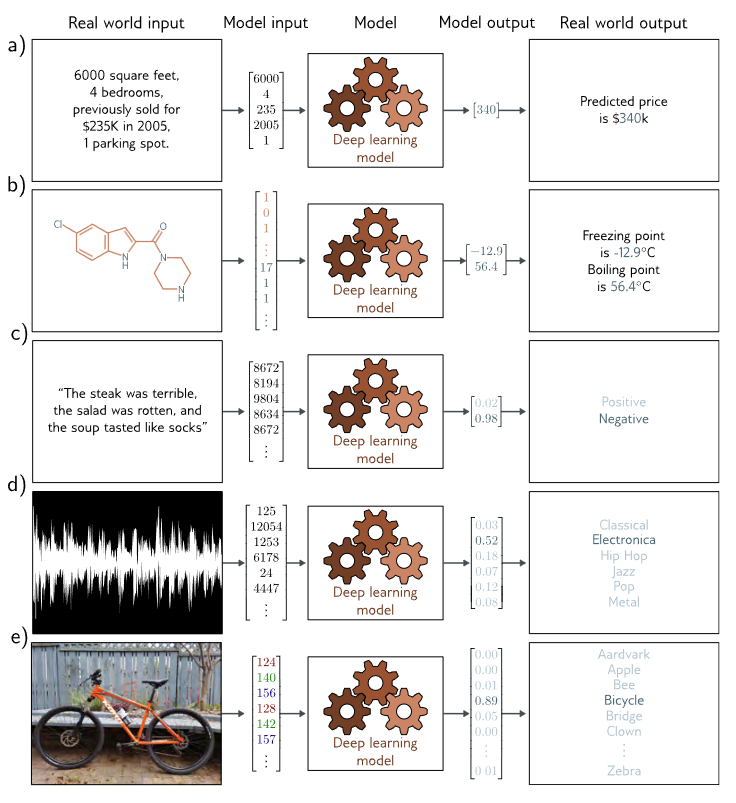
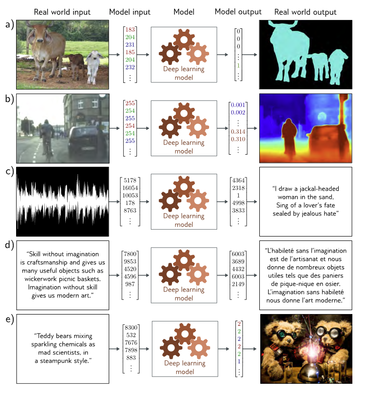
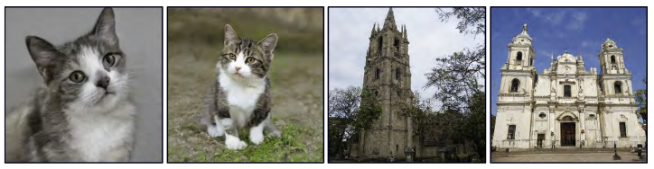
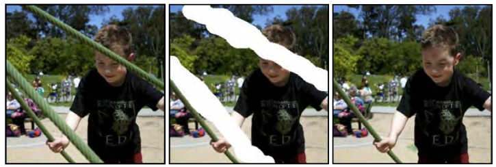
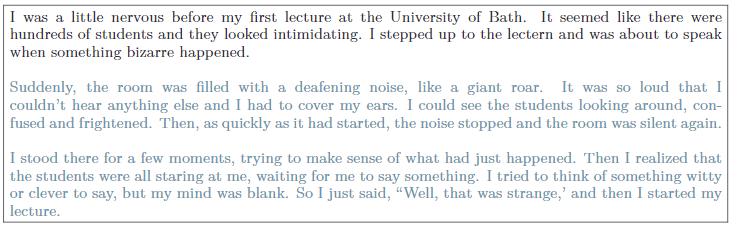
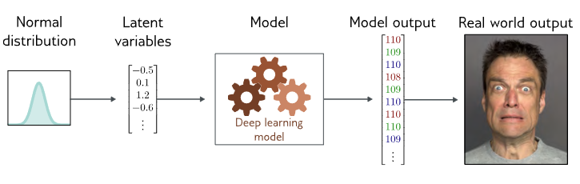

#### 1. Supervised Learning

##### 1.1 Defination

* Supervised learning models define a mapping from input data to an output prediction.

##### 1.2 Regression and Classification

* Regression: continious real numbers
* Classification: discrete positive numbers indicating different classes

a) This regression model takes a vector of numbers that characterize a property and predicts its price.

b) Thismultivariate regression model takes the structure of a chemical molecule and predicts its melting and boiling points.

c) This binary classification model takes a restaurant review and classifies it as either positive or negative.

d) This multiclass classification problem assigns a snippet of audio to one of $ N$ genres.

e) A second multiclass classification problem in which the model classifies an image accordingto which of $N$ possible objects it might contain.

##### 1.3 Inputs

* Stuctural/Tabular Data: whether the data has internal structures or not
* Order can be important
* Multidimentional/Multisize Inputs

##### 1.4 Models/Why supervised?

* The model represents a family of equations mapping the input tothe output
* The particular equation is chosen using *training data* (examples of input/output pairs)
* The input/output pairs take the role of a 'teacher' or supervisor for the training process, and this gives rise to the term ***supervised learning***.

##### 1.5 Deep Neural Networks

* DNNs, which are a particularly useful type of machine learning model, representing extremely broad family of relationships between input and output, and where it is particularly easy to search through this family to find the relationship that describes the training data
* DNNs can process inputs that are very large, of variable length, and contain various kinds of internal structures

##### 1.6 Structured Outputs

a) This *semantic segmentation* model maps an RGB image to a binary image indicating whethereach pixel belongs to the background or a cow (adapted from Noh et al., 2015).

b) This monocular depth estimation model maps an RGB image to an outputimage where each pixel represents the depth (adapted from Cordts et al., 2016).

c) This audio transcription model maps an audio sample to a transcription ofthe spoken words in the audio.

d) This translation model maps an English textstring to its French translation.

e) This image synthesis model maps a caption toan image (example from https://openai.com/dall-e-2/). In each case, the outputhas a complex internal structure or grammar. In some cases, many outputs arecompatible with the input.

#### 2. Unsupervised Learning

##### 2.1 Unsupervised Models

* Constructing a model from input data without corresponding output labels is termed ***unsupervised learning***, the absence of output labels means there can be no "supervision.""
* The goal is to describe or under-stand the ***structure*** of the data.

##### 2.2 Generative models

* ***Generative unsupervised models***, which learn to synthesize newdata examples that are statistically indistinguishable from the training data.
* Some generative models explicitly describe the probability distribution over the input data andhere new examples are generated by sampling from this distribution. Others merely learna mechanism to generate new examples without explicitly describing their distribution
* Examples:

1. Synthesize examples distinct from the training examples:

Left: two images were generated from a model trained on pictures of cats. These are not real cats, but samples from a probability model.

Right: two images generated from a model trained on imagesof buildings. Adapted from Karras et al. (2020b).

Short story synthesized from a generative model of text data. The model describes a probability distribution that assigns a probability to every output string. Sampling from the model creates strings that follow the statistics of the training data (here, short stories) but have never been seen before.

2. Synthesizing data under the constraint that some outputs are predetermined (termed ***conditional generation***)

In the original image (left), the boy is obscured by metalcables. These undesirable regions (center) are removed and the generative modelsynthesizes a new image (right) under the constraint that the remaining pixelsmust stay the same. Adapted from Saharia et al. (2022a)

Given an initial body of text (in black),generative models of text can continue the string plausibly by synthesizing thev "missing" remaining part of the string. Generated by GPT3 (Brown et al., 2020).

##### 2.3 Latent Variables

* Some (but not all) generative models exploit the observation that data can be lowerdimensional than the raw number of observed variables suggests, which leads to new methods to manipulating data
* We can describe each data example using a smaller number of underlying latent variables.
* The latent variables typically have a simple probability distribution by design, By sampling from this distribution and passing theresult through the deep learning model, we can create new samples

##### 2.4 Connecting supervised and unsupervised models

* Generative models with latent variables can benefit supervised learning models where the outputs have structure
* Rather than directly map the inputs to outputs, we can learn a relation between latent variables that explain the inputs and the ones explain the outputs.
* 3 advantages:
  1. Fewer data since the input/output pairs are lower dimensional
  2. More Plausible outputs due to sensible values of latent variables
  3. Introducing randomness to either the mapping between the two sets of latent variables or the mapping from the latent variables to the outputs, then we can generate multiple outputs that are all matching well with the outputs

#### 3. Reinforcement Learning

* This paradigm introduces the idea of an agent which lives in a world and can perform certain actions at each timestep
