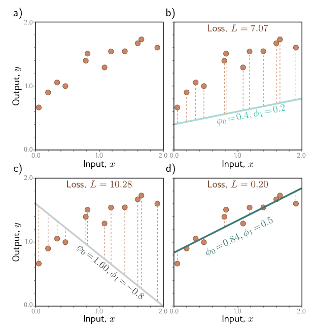

#### 1. Supervised Learning

##### 1.1 Overview

* In supervised learning, we aim to build a model that takes an input $x$ and outputs a prediction $y$ , computing the prediction $y$ from the input $x$ , we call this ***inference***.
* Model can be denoted as : $y=f[x]$, the model also contains parameters $\phi$, the choice of parameters determins the paticular relation between inputs and outputs, thus the model should be denoted as: $y=f[x,\phi]$
* Learning and Training a model means finding parameters $\phi$ to fit a sensible relation between $x$ and $y$
* The goal is to select parameters that map each training input to its associated output as closelyas possible. The degree of mismatch in this mapping can be quantified with the loss $L$.
* $L$ can be treated as a function $L[\phi]$ of parameters $\phi$, The training process aims to fine the $\phi$ which minimizes the loss funtion: $\hat{\phi} = \mathop{argmin}\limits_{\phi}[L[\phi]]$

#### 2. Linear Regression Example

##### 2.1 1D Linear Regression

* The model can be described as : $y = f[x, \phi] = \phi_0 + \phi_1 x$

For a given choice of parameters $\phi=[\phi_0,\phi_1]^T$, the model makes a predic-tion for the output (y-axis) based onthe input (x-axis).  Different choicesfor the y-intercept $\phi_0$ and the slope $\phi_1$ change these predictions (cyan, orange,and gray lines). The linear regression model  defines a family ofinput/output relations (lines) and theparameters determine the member of thefamily (the particular line)

##### 2.2 Loss Function

* The loss Function can be described as: $L[\phi] = \sum(f[x_i,\phi]-y_i)^2$ (***Least Squares Errors***)
* The goal is to find the parameters $\phi$ that minimize the quantity of loss

Different params and losses

Loss function for linear regression model with the dataset in previous figure.

a) Each combination of parameters has an associated loss. The result-ing loss function can be visualized as a curved surface. The three circles represent the three lines in previous figure.

b) The loss can also be visualized as a heatmap, where brighter regions represent larger losses; here we are looking straight downat the surface in (a) from above and gray ellipses represent isocontours. The best fitting line (d) has the parameters with the smallest loss (green circle)

##### 2.3 Training

* The process of finding parameters that minimize the loss is termed ***model fitting***, ***training***,or ***learning***.
* One way to do the finding is measuring the gradient of the surface at the current position and take a step in the direction that is most steeply downhill, Then repeating this process until the gradient is flat and we can improve no further.

Linear regression training. The goal is to find the y-intercept and slope parameters that correspond to the smallest loss.

a) Iterative training algorithmsinitialize the parameters randomly and then improve them by "walking downhill" until no further improvement can be made. Here, we start at position 0 and move a certain distance downhill (perpendicular to the contours) to position 1. Then we re-calculate the downhill direction and move to position 2. Eventually, we reach the minimum of the function (position 4).

 b) Each position 0–4 from panel(a) corresponds to a different y-intercept and slope and so represents a differentline. As the loss decreases, the lines fit the data more closely

##### 2.4 Testing

* Computing the loss on ***test data*** can measure how does the trained model perform in the real world
* The ***degree*** to which the prediction accuracy generalizes to the test data depends in part on how representative and complete the training data is, but it also depends on how expressive the model is.
* Low expressive model which leads to low degree is knowned as ***underfitting***, Conversely, a very expressive model may describe statistical peculiarities of the training data that are atypical and lead tounusual predictions. This is known as ***overfitting***.

##### 2.5 Notes

**Loss functions vs. cost functions:**

* the terms ***loss function*** and ***cost function*** can be used interchangeably.
* more properly, a loss function is the individual term ***associated with a data point***, and the cost function is the ***overall quantity that is minimized*** . A cost function can contain ***additional terms*** that are not associated with individual data points.
* ***objective function*** is any function that is to be maximized or minimized.

**Generative vs. discriminative models:**

* The model $y=f[x,\phi]$ is a discriminative model, which make an output prediction $y$ from real-world measurements $x$.
* $x=g[y,\phi$] is a generative model, in which the real-world measurements $x$ are computed as a function of the output $y$. To perform *inference*, the equation must be inverted as $y=g^{−1}[x,\phi]$, and this may be difficult.
* Generative models have the advantage that we can build in prior knowledge about how the data were created. For example, if we wanted to predict the 3D position and orientation $y$ of a car in an image $x$, then we could build knowledge about car shape, 3D geometry, and light transport into the function $x=g[y,\phi]$.
* Discriminative models dominate modern machinelearning; the advantage gained from exploiting prior knowledge in generative models is usually trumped by learning very flexible discriminative models with large amounts of training data.
